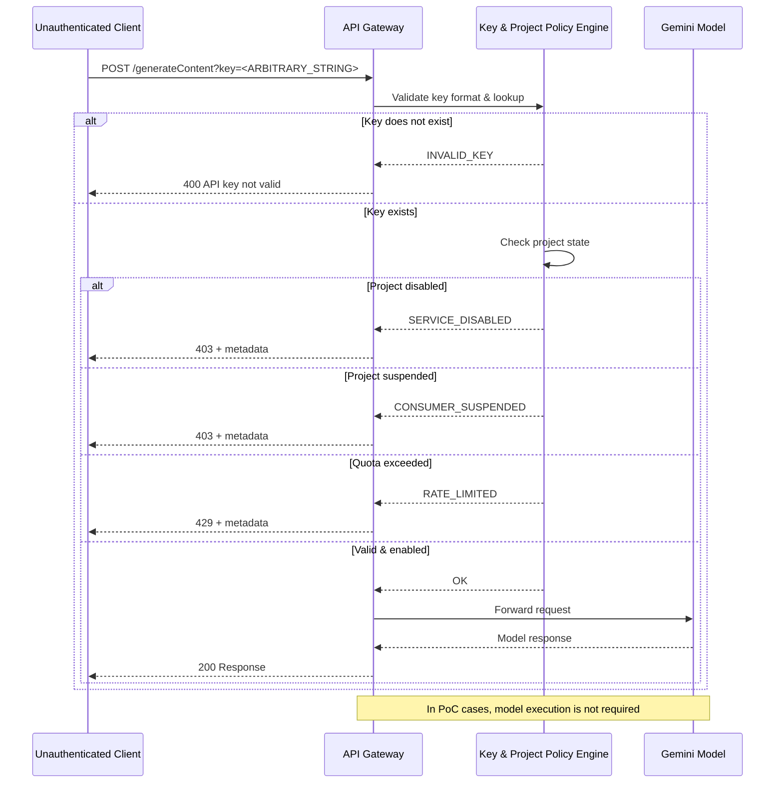
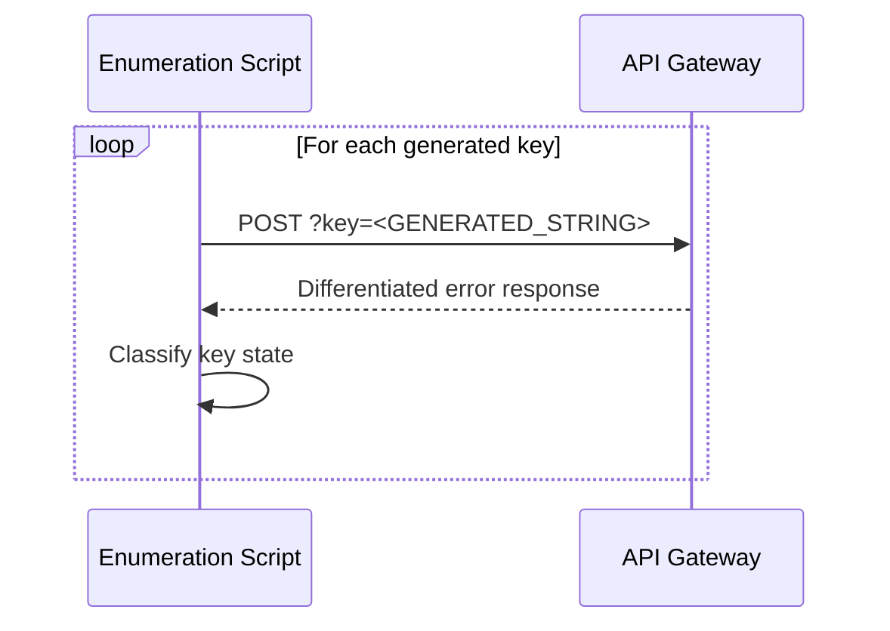
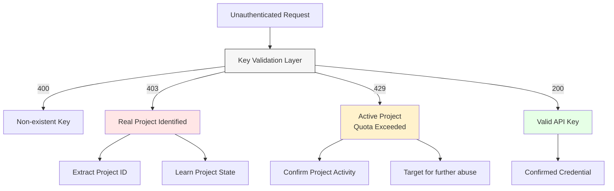

# gemini-api-key-validation-analysis

**Technical analysis and proof-of-concept demonstrating how the Google Gemini / Generative Language API validates API-key-shaped input and returns differentiated error semantics prior to model execution.**

---

## Overview

This repository documents a technical analysis of the **pre-authentication API key validation behavior** implemented by the Google Gemini / Generative Language API (`generativelanguage.googleapis.com`).

The focus of this work is **not model behavior**, prompt processing, or AI output, but rather the **API gateway and key-validation layer** that processes requests *before* any Gemini model execution occurs.

The analysis demonstrates that:

- Arbitrary API-key-shaped input is accepted without authentication
- The validation layer returns **distinct, structured error responses**
- These responses allow classification of key state and project association
- Model execution is not required to observe this behavior

This repository is intended as a **neutral, technical research artifact**.

---

## Scope & Non-Goals

### In Scope
- API gateway behavior
- Pre-authentication key validation
- Error semantics and response differentiation
- Automation feasibility

### Out of Scope
- Gemini model internals
- Prompt injection or LLM attacks
- Quota bypass or billing abuse
- Claims of secret data exposure

---

## Simplified Reproduction Request

The behavior can be observed using a **single unauthenticated HTTPS request**.

```http
POST https://generativelanguage.googleapis.com/v1/models/gemini-2.5-flash:generateContent?key=AIzaSyAAAAAAAAAAAAAAAAAAAAAAAAAAAAAAA
Content-Type: application/json

{
  "contents": [
    { "role": "user", "parts": [ { "text": "ping" } ] }
  ]
}
```

No valid API key, Google account, or Gemini usage is required.

Repeating this request with different API-key-shaped strings results in **deterministic, differentiated responses**.

---

## Observed Response Classes

| HTTP Code | Classification | Notes |
|---------|---------------|------|
| 400 | Invalid Key | Key does not map to any project |
| 403 | Service Disabled | Key maps to real project (disabled) |
| 403 | Consumer Suspended | Project suspended |
| 429 | Rate Limited | Project quota exceeded |
| 200 | OK | Request forwarded to model |

Certain error responses include metadata referencing:

```
projects/<PROJECT_ID>
```

---

## Architecture Perspective

### Request Flow



---

## Threat Model

### Actors

- **Attacker**: Any unauthenticated internet user
- **Victim**: Google Cloud projects using Gemini / Generative Language APIs

### Assumptions

- Attacker has no Google account
- Attacker has no valid API key
- Attacker can generate API-key-shaped strings

### Capabilities

- Send arbitrary HTTPS requests
- Observe response codes and error bodies
- Automate requests at scale

### Observed Effects

- Validation of key existence
- Classification of project operational state
- Confirmation of project association

---

## Automation Scenario




The provided PoC demonstrates this behavior using parallel requests and response parsing.

---

## Security Discussion

This work does **not** assert that:

- Project IDs are secret
- API keys can be brute-forced feasibly
- Authentication is bypassed

Instead, it documents that:

- Pre-auth validation exists
- Error semantics are differentiated
- The API functions as a **classification oracle** for attacker-supplied input

The impact lies in **response behavior**, not in exploitation.

---

## Ethical Notice

- No private API keys were used
- No billing or quota abuse was performed
- All observations were made via standard API interaction

This repository is published for **educational and research purposes only**.

---

## License

MIT License

---

## Author

32BYTX **Independent security research**

